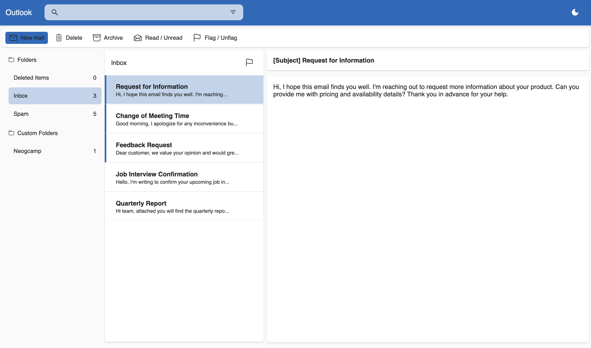

# Outlook Prototype



## Introduction

This project is a prototype of the popular email provider, Outlook. It is built using NextJS and uses the JSON files to retrieve & display the mail information.

## Features

1. When the app starts, the app loads the contents of each folder and displays the unread counts.
1. Users can move around within the app to Inbox, Spam and Custom Folder.
1. Users can select any mail and look into the contents
1. Users can see a brief preview before clicking on it.
1. Users can delete a message. In which case the message comes in deleted items.
1. Users can flag a message.
1. Users can filter inbox on whether a message is flagged or not.
1. State and navigation should be saved between refreshes.

## Built With

1. NextJS
1. NextJS API routes
1. ReactJS Context API (State Management)
1. Styled-Components

## Getting Started

First, run the development server:

```bash
npm run dev
# or
yarn dev
# or
pnpm dev
```

Open [http://localhost:3000](http://localhost:3000) with your browser to see the result.
